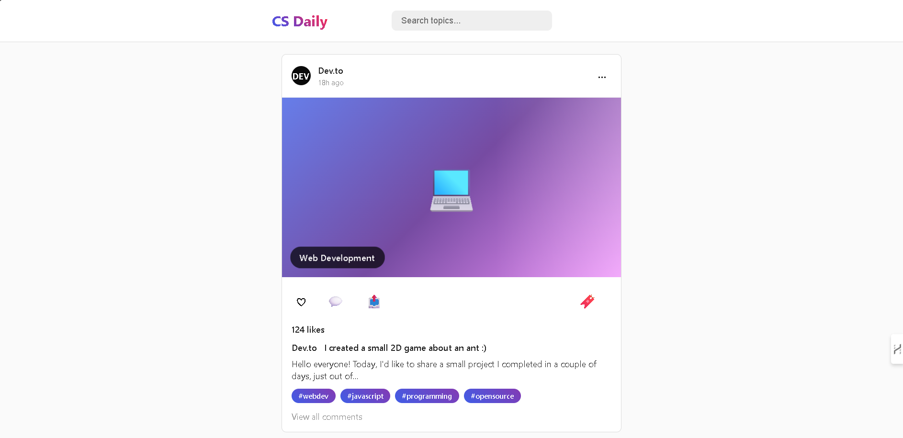

# 🚀 CS Daily - Infinite Scroll Tech Feed  

An **Instagram-like infinite scroll feed** for tech content.  
Built with **vanilla HTML, CSS, JavaScript** — it fetches live articles from **Dev.to** & **GitHub Trending Repositories**, with **mock data fallback** for smooth experience.

---

## ✨ Features
- 🔄 Infinite scroll (auto-load more posts as you scroll)  
- 🔍 Live search (filter posts by title, description, or tags)  
- ❤️ Like button with animation & real-time like updates  
- 📂 Tech topics (AI, Web Dev, Cybersecurity, Cloud, Quantum, etc.)  
- 📱 Responsive design (mobile-friendly)  
- 🎨 Instagram-like UI with smooth animations  

---

## 📸 Screenshots

Example:  


---

## 🛠️ Tech Stack
- **HTML5**  
- **CSS3** (custom styling, animations, gradients)  
- **JavaScript (ES6)**  

APIs used:  
- [Dev.to Articles API](https://developers.forem.com/api)  
- [GitHub Search API](https://docs.github.com/en/rest/search)  
- Mock posts generator (for fallback + demo data)

---

## 🚀 How to Run
1. Clone this repo:
   ```bash
   git clone https://github.com/your-username/Infinite-Scroll.git
   cd Infinite-Scroll
2. Open index.html in your browser.

3. Scroll down to load posts infinitely 🔥.
